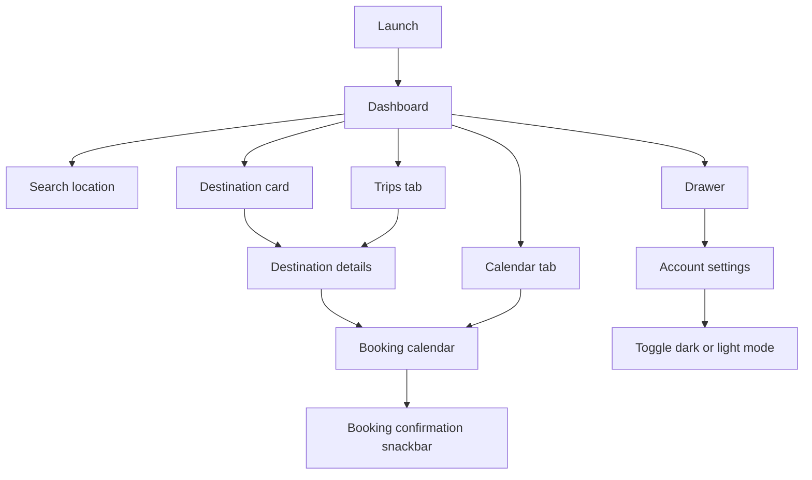

# Travel App Response Flow

## Product response proposal

The drawer interaction already establishes the right motion language: direct, smooth, and spatially clear. The same principle should apply to every bottom-tab interaction. A tab tap must always produce a visible screen transition, update the active indicator, preserve that tab's state, and never leave the user on a screen that belongs to another tab.

## Product intent
A polished hotel discovery experience based on the supplied Figma reference. The app prioritizes fast destination discovery, clear booking actions, and a consistent dark/light visual system.

## Navigation map



## Bottom navigation contract

| Tab | Destination | Response | State to preserve |
| --- | --- | --- | --- |
| Dashboard | Dashboard | Replace the current tab body with the discovery feed | Search query and scroll position |
| Trips | Trips | Replace the current tab body with upcoming and past stays | Selected trip and filter |
| Calendar | Calendar | Replace the current tab body with booking dates | Visible month and selected range |
| Account | Account | Open the account/settings screen | Theme mode and settings state |

### Interaction rules

- Tapping an unselected tab switches immediately to its destination screen.
- Tapping the active tab keeps the user on that screen and scrolls to the top only when that behavior is intentionally selected in the product spec.
- The active tab uses the blue filled pill; inactive tabs use icon-only controls.
- Switching between Dashboard, Trips, and Calendar should use a short ease-out fade or horizontal slide. Avoid a full-stack push transition for peer tabs.
- Opening a detail or booking screen uses a forward transition; back returns to the originating tab with its previous state intact.
- The Account avatar remains a direct route to Account and must also update the active Account indicator.
- Every tab needs loading, populated, empty, and error states so the navigation never appears non-responsive.

## Screen response flows

### Dashboard
- The app opens on the Dashboard with a greeting, search field, and recommended stays.
- Tapping a destination card opens its details screen.
- Tapping the menu icon opens the account drawer.
- Bottom navigation opens Dashboard, Trips, Calendar, and Account as real destinations; it is not only a selection indicator.
- Search accepts text input and provides a native keyboard response.

### Trips
- Shows upcoming reservations first, followed by a past-stays section.
- Tapping an upcoming reservation opens the same destination details screen.
- An empty state explains that a stay will appear after the first confirmed booking.
- A failed data load offers retry without changing the selected tab.

### Calendar
- Shows the current month with the selected booking range highlighted.
- Month navigation changes only the calendar state and keeps the user in Calendar.
- Tapping an available date updates the range; unavailable dates remain visibly disabled.
- Confirming a range returns to Trips with a success response, or keeps the user in context when confirmation is incomplete.

### Destination details
- The back affordance returns to the previous screen.
- The screen presents host, rating, reviews, address, and description content.
- `Book this stay` opens the booking calendar.

### Booking calendar
- The selected stay shows a two-night summary and date range.
- Calendar dates are visually selectable-state ready, with the reference dates highlighted.
- `Confirm booking` shows a success snackbar and preserves the user in context.
- `Cancel Date` is the visible cancellation action for the prototype state.

### Account and appearance
- Account lists reusable settings tiles with clear secondary descriptions.
- The Appearance switch changes the app between dark and light themes through GetX reactive state.
- Settings that are not part of the prototype remain responsive but intentionally non-destructive.
- Subscription communicates its unavailable state with `Coming Soon`.

## Gradient color system

Use one restrained linear gradient family across the app so the dark and light modes feel related without becoming flat. Gradients should be applied to the page background only; panels, cards, and navigation remain solid surfaces for legibility.

### Dark mode

```text
LinearGradient(
  begin: topRight,
  end: bottomLeft,
  stops: [0.00, 0.48, 1.00],
  colors: [#0B2A3D, #090D0E, #06263A],
)
```

- Primary action: `#159CF4`
- Panel surface: `#1E1E20`
- Main text: `#FFFFFF`
- Secondary text: `#9EA4AA`
- Warning/action text: `#FF9D00`

### Light mode

```text
LinearGradient(
  begin: topRight,
  end: bottomLeft,
  stops: [0.00, 0.48, 1.00],
  colors: [#E4F5FF, #F5F7F8, #DFF2FF],
)
```

- Primary action: `#159CF4`
- Panel surface: `#FFFFFF`
- Main text: `#102027`
- Secondary text: `#68747B`
- Warning/action text: `#D97900`

### Gradient quality rules

- Keep the gradient angle and stop positions identical in both themes.
- Do not place long paragraphs directly over the gradient; use a solid panel or a readable surface layer.
- Keep blue concentrated at the edges so the content area remains calm and high contrast.
- Preserve the same blue action color in both themes so interaction meaning does not change.
- Verify contrast, text wrapping, and bottom-navigation readability at compact and large mobile widths.

## State and architecture
- `AppController` owns selected tab, theme mode, search query, selected destination state, and per-tab restoration state.
- `GetMaterialApp` owns named navigation routes.
- Peer tabs should be represented by a tab shell or an indexed page container; use named routes for detail, booking, and Account-level flows.
- Shared visual primitives live in `core/theme` and `widgets`.
- Feature screens are grouped under `screens/home`, `screens/detail`, `screens/booking`, and `screens/account`.
- Destination content is isolated in `data/models` so a remote repository can replace the sample data later.

## Validation checklist
- Run `flutter pub get`.
- Run `flutter analyze`.
- Run `flutter test`.
- Run `flutter build apk --release` for the Android deliverable.
- Compare Dashboard, Detail, Booking, and Account at compact and large mobile widths.
- Verify each bottom tab changes visible content, updates its selected indicator, and preserves state after returning from Detail or Booking.
- Verify the dark and light gradients at the top, center, and bottom of each screen.
